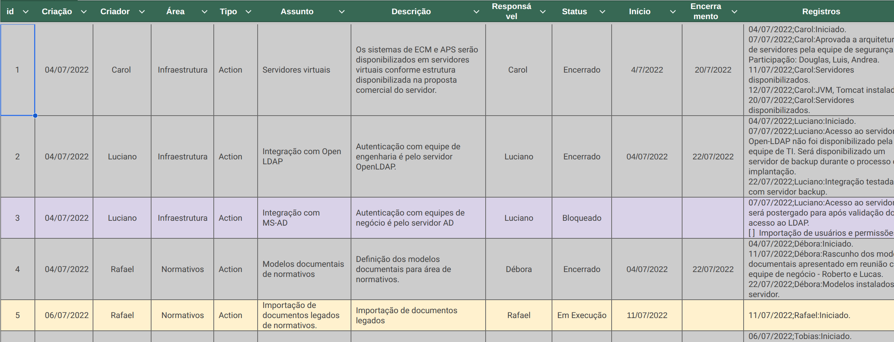

O uso de listas de tarefas é uma opção simples e fácil para se gerenciar o trabalho em projetos.

É possível obter-se informações sobre o fluxo do trabalho (WIP, Lead Time, etc), e sobre a qualidade dos resultados como forma de avaliar e controlar a execução do trabalho.

## Estrutura da Lista de Trabalho

A Lista de Trabalho pode ser mantida em uma planilha de Excel ou Google-Calc utilizando uma estrutura semelhante a da figura x.

As colunas possuem os seguintes propósitos:

- id: identificador único da tarefa

- Criação: a data da criação da tarefa será útil para avaliar o fluxo de controle do escopo do projeto.

- Criador: o nome do criado será importante para determinar o responsável pela validação da conclusão da tarefa.

- Área: em alguma situações vamos preferir fazer análises por área ao invés da visão geral das atividades.

- Assunto: sempre que possível vamos padronizar os assuntos permitindo agrupar as tarefas e avaliar a estabilidade de um determinado tema/assunto.

- Descrição: descrição breve da tarefa dentro do assunto.

- Responsável: nome do responsável por conduzir a tarefa. O responsável pode mudar durante a execução da mesma. Nestes casos um comentário a respeito da mudança deve constar na coluna Registros.

- Status: um dentre os estados

  - Aberto: estado inicial

  - Em execução: tarefa começou a ser executada

  - Bloqueado: tarefa está bloqueada aguardando resolução de pendência

  - Encerrado: tarefa foi concluída

- Início: data do início (importante para cálculo de indicadores de fluxo)

- Encerramento: data de término (importante para cálculo de indicadores de fluxo)

- Registros: informações sobre o fluxo do trabalho e decisões tomadas durante a execução da tarefa. Os registros devem sempre ser anotados no formato \<data\>;\<nome\>:\<descrição\>.

## Informações sobre o Fluxo de Trabalho

A partir da lista de tarefas é possível obter as seguintes informações sobre o fluxo e trabalho:

1.  Diagrama de Fluxo Acumulado (CFD - *Cumulative Flow Diagram*)
    1.  O CFD provê uma visão clara tanto da evolução do fluxo de trabalho quanto das variáveis a seguir.
2.  Trabalho em Progresso (WIP)
    1.  Precisamos tanto do WIP calculado na data de status quanto do histórico de evolução do mesmo.
3.  Tempo de Entrega (Lead Time)
    1.  Precisamos tanto do Lead Time na data de status quanto do histórico de evolução do mesmo.
4.  Tarefas Bloqueadas
    1.  Um indicador quantitativo do número de tarefas que estão bloqueadas.

Ao final queremos um *dashboard* com as informações acima semelhante ao da figura yy.