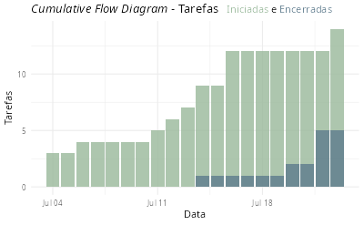

Um Diagrama de Fluxo Acumulado (ou *Cumulative Flow Diagram* - CFD) oferece uma forma fácil e rápida de identificar tanto o WIP quanto o Lead Time de um fluxo de trabalho. O primeiro se dá pela diferença vertical entre as curvas de início de tarefas e término de tarefas. O segundo é calculado pela diferença horizontal das mesmas curvas.



## CFD a partir de lista de tarefas

Para se obter um CFD a partir de uma Lista de Tarefas conforme descrita [neste post](https://abreums.github.io/posts/2026-06-20-lista-de-tarefas/) e representada na imagem abaixo utilizamos as informações das colunas Status, Data de Início e Data de Encerramento.


A função abaixo recupera as informações das tarefas iniciadas e encerradas:

```{r}
#| eval: false
# get_cfd_tasks - A partir de uma lista de tarefas,
#                 a função conta o número de tarefas
#                 iniciadas e encerradas por dia.
# Parâmetros:
#   ldf_raw - lista de atividades contendo ao menos as colunas:
#     status: Aberto, Em Execução, Bloqueado, Encerrado
#     iniciado: POSIXct - data de início
#     encerrado: POSIXct - data de encerramento
#   time_window - inteiro representando os dias da 
#                 janela de tempo a ser considerada
#                 para obter a lista de tarefas do CFD.
get_cfd_tasks <- function(ldf_raw, time_window = NULL) {
  # Todas as datas ajustadas para data sem hora:
  ldf_raw <-
    ldf_raw |>
    dplyr::mutate(dplyr::across(dplyr::where(lubridate::is.POSIXct), as.Date))

  # Precisamos da lista de atividades iniciadas e encerradas.
  # Estamos excluindo as atividades planejadas não iniciadas.
  cfd_tasks <-
    ldf_raw |>
    dplyr::filter(status %in% c("Encerrado", "Em Execução"))

  # Precisamos de uma sequência de datas
  # da atividade iniciada mais antiga
  # até a atividade iniciada mais recente:
  date_seq = seq.Date(
    from = min(cfd_tasks$inicio),
    to = max(c(
      max(cfd_tasks$inicio, na.rm = TRUE),
      max(cfd_tasks$encerramento, na.rm = TRUE)
    )),
    by = "day"
  )

  # Vamos montar duas sequencias: iniciadas e encerradas.
  ## Atividades iniciadas:
  tsk_started <-
    cfd_tasks |>
    dplyr::count(inicio) |>
    dplyr::arrange(inicio) |>
    tidyr::complete(inicio = date_seq, fill = list(n = 0)) |>
    dplyr::mutate(cum_n = cumsum(n)) |>
    dplyr::mutate(status = "Iniciado") |>
    dplyr::rename(dt_status = inicio)

  ## Atividades terminadas:
  tsk_finished <-
    cfd_tasks |>
    dplyr::filter(status %in% c("Encerrado")) |>
    dplyr::count(encerramento) |>
    dplyr::arrange(encerramento) |>
    tidyr::complete(encerramento = date_seq, fill = list(n = 0)) |>
    dplyr::mutate(cum_n = cumsum(n)) |>
    dplyr::mutate(status = "Encerrado") |>
    dplyr::rename(dt_status = encerramento)

  ## Vamos juntar as duas sequências em um grupo único
  cfd_tsk_count <-
    dplyr::bind_rows(tsk_started, tsk_finished) |>
    dplyr::select(-n)

  # Ajusta para um intervalo:
  end_date <- max(cfd_tsk_count$dt_status)
  start_date <- min(cfd_tsk_count$dt_status, na.rm = TRUE)
  if (!is.null(time_window)) {
    start_date <- max(start_date, end_date - time_window)
  }
  cfd_tsk_count <-
    cfd_tsk_count |>
    filter(
      dt_status %within%
        lubridate::interval(start = start_date, end = end_date)
    )
}
```

Para gerar um diagrama de fluxo acumulado podemos utilizar a função abaixo:

```{r}
#| eval: false
# plot_cfd - A partir de uma lista de número de tarefas 
#            iniciadas e encerradas por dia, 
#            gerar um CFD
# Parâmetros:
#    tsk_count - tibble com as colunas:
#       dt_status: as.Date
#       cum_n: número de tarefas iniciadas / encerradas (acumulado)
#       status: Iniciado, Encerrado
plot_cfd <- function(tasks) {
  p <-
    tasks |>
    ggplot2::ggplot(aes(dt_status, cum_n, group = status, fill = status)) +
    ggplot2::geom_col(alpha = 0.8, position = "identity") +
    ggplot2::scale_fill_manual(
      values = c(
        "Outro" = "#C85D3D",
        #"Infraestrutura" = "#0F4C5C",
        "Encerrado" = "#5D7A8C",
        "Iniciado" = "#98B89A"
        #, "final" = "#FFE6A7"
      )
    ) +
    labs(
      title = "*Cumulative Flow Diagram* - 
        Tarefas <span style='font-size:11pt'> 
        <span style='color:#98B89A;'>Iniciadas</span> e
        <span style='color:#5D7A8C;'>Encerradas</span>
        </span>",
      x = "Data",
      y = "Tarefas"
    ) +
    theme_minimal() +
    theme(
      plot.title = element_markdown(lineheight = 1.1),
      legend.text = element_markdown(size = 11)
    ) +
    theme(legend.position = 'none')
}
```