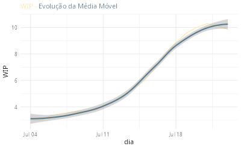

O controle do WIP (Work In Progress) é fundamental para avaliar a efetividade do fluxo do trabalho.

A análise do histórico do WIP provê uma visão se o mesmo é estável ou possui alguma tendência.

Vamos construir uma gráfico com a tendência do WIP considerando uma lista de tarefas conforme descrita [neste post](https://abreums.github.io/posts/2026-06-20-lista-de-tarefas/).

O gráfico que queremos gerar é este:



## Histórico do WIP a partir de uma Lista de Tarefas

Para se obter um CFD a partir de uma Lista de Tarefas conforme descrita [neste post](https://abreums.github.io/posts/2026-06-20-lista-de-tarefas/) e representada na imagem abaixo utilizamos as informações das colunas Status, Data de Início e Data de Encerramento.

A função abaixo utiliza uma contagem de tarefas iniciadas e encerradas por dia, conforme apresentado [neste post](https://abreums.github.io/posts/2026-06-27-cfd/).

A contagem é feita considerando a média móvel calculada através do pacote **slider**.

```{r}
#| eval: FALSE

# get_wip_sequence - Para as tarefas selecionadas,
#                    Calcula o WIP para cada data,
#                    e a média móvel de 7 dias.
get_wip_sequence <- function(cfd_tsk_count) {
  wip_sequence <-
    cfd_tsk_count |>
    dplyr::arrange(dt_status) |>
    tidyr::pivot_wider(names_from = status, values_from = cum_n) |>
    dplyr::mutate(wip = Iniciado - Encerrado) |>
    dplyr::select(dt_status, wip) |>
    dplyr::mutate(
      rolling_mean = slider::slide_index_mean(
        x = wip,
        i = dt_status,
        before = lubridate::as.difftime(6, units = "days"), # 6 days before + current day = 7 days
        after = 0
      )
    )
}


```

Para gerar um diagrama da Média Móvel do WIP podemos utilizar a função abaixo:

```{r}
#| eval: false
#| 
# plot_wip_rolling_mean - histórico do WIP com a média móvel
plot_wip_rolling_mean <- function(wip_sequence) {
  p <-
    wip_sequence |>
    ggplot2::ggplot(aes(x = dt_status, y = rolling_mean)) +
    ggplot2::geom_line(color = "#FFE6A7") +
    ggplot2::geom_smooth(color = "#5D7A8C") +
    ggplot2::labs(
      title = "<span style='font-size:11pt'><span style='color:#FFE6A7;'>WIP - </span><span style='color:#5D7A8C;'>Evolução da Média Móvel</span>
              </span>",
      x = "dia",
      y = "WIP"
    ) +
    ggplot2::theme_minimal() +
    ggplot2::theme(
      plot.title = ggtext::element_markdown(lineheight = 1.1),
      legend.text = ggtext::element_markdown(size = 12)
    ) +
    ggplot2::theme(legend.position = 'none')
}

```