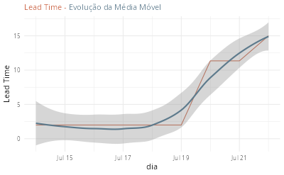

O *Lead Time* fornece a percepção do cliente do tempo de resposta da equipe do projeto. Por este motivo é uma medida importante de acompanhar.

Vamos gerar um gráfico com a evolução do *Lead Time* como mostrado a seguir:



Em projetos controlados por Lista de atividades, como descrito neste [neste post](https://abreums.github.io/posts/2026-06-20-lista-de-tarefas/), o *Lead Time* deve ser considerado a partir do momento de início da execução da atividade. Nem todo dia haverá uma atividade que está iniciando ou encerrando, ou seja, não temos *Lead Time* para todo dia de um projeto. Uma alternativa é utilizarmos uma média móvel para identificar o *Lead Time* a cada dia e trabalhar com a tendência do mesmo no tempo.

O primeiro passo é identificar os feriados para exclui-los da contagem de dias do *Lead Time*. Esta é a finalidade da função abaixo:

```{r}
#| eval: false

# calc_business_days: 
# Função para contar apenas dias úteis 
# (exluir os fds e feriados)
calc_business_days <- function(start, finish) {
  holiday_list <- as.Date(c(
    "2026-01-01", # Ano Novo
    "2026-01-25", # SP - Aniversário SP
    "2026-02-16", # Carnaval
    "2026-02-17", # Carnaval
    "2026-02-18", # Quarta-Cinzas
    "2026-04-03", # Sexta-feira Santa
    "2026-04-21", # Tiradentes
    "2026-05-01", # Dia do Trabalho
    "2026-06-04", # Corpus Christi
    "2026-07-09", # SP - Revolução Constitucionalista
    "2026-09-07", # Independência
    "2026-10-12", # Nossa Sra Aparecida
    "2026-11-02", # Finados
    "2026-11-15", # República
    "2026-11-20", # Consciência Negra
    "2026-12-24", # pré-Natal
    "2026-12-25", # Natal
    "2027-01-01" # Ano Novo
  ))

  # gera sequência de datas:
  all_days <- seq(start, finish, by = "day")
  # excluir os fds (Sábado = 7, Domingo = 1) e feriados
  biz_days <-
    all_days[!wday(all_days) %in% c(1, 7) & !all_days %in% holiday_list]

  return(length(biz_days))
}
```

A função abaixo calcula a média móvel do Lead Time e gera um gráfico com a tendência da evolução da mesma.

```{r}
#| eval: false
# get_finished_tasks_lead_time - 
#                 A partir de uma lista de tarefas,
#                 a função devolve a média móvel do 
#                 Lead Time considerando o intervalo
#                 da data mais antiga até a data mais recente
#                 das tarefas concluídas.
# Parâmetros:
#   ldf_raw - lista de atividades contendo ao menos as colunas:
#     status: Aberto, Em Execução, Bloqueado, Encerrado
#     iniciado: POSIXct - data de início
#     encerrado: POSIXct - data de encerramento
get_finish_tasks_lead_time <- function(ldf_raw) {
  lead_time_list <-
    ldf_raw |>
    dplyr::filter(!is.na(encerramento)) |>
    dplyr::select(id, assunto, inicio, encerramento) |>
    dplyr::mutate(
      inicio = as.Date(inicio),
      encerramento = as.Date(encerramento)
    ) |>
    dplyr::mutate(
      lead_time = purrr::map2_dbl(
        inicio,
        encerramento,
        ~ calc_business_days(.x, .y)
      )
    )

  calendar <-
    tidyr::tibble(
      date = seq(
        min(lead_time_list$encerramento),
        max(lead_time_list$encerramento),
        by = "day"
      )
    )

  daily_lead_time <-
    calendar |>
    dplyr::left_join(
      lead_time_list |> dplyr::select(encerramento, lead_time),
      dplyr::join_by("date" == "encerramento")
    )

  daily_lead_time <-
    daily_lead_time |>
    dplyr::mutate(
      rolling_85_quantile_lead_time = slider::slide_index_dbl(
        .x = lead_time,
        .i = date,
        .f = ~ quantile(.x, probs = 0.85, na.rm = TRUE),
        .before = days(30)
      )
    )
}

```

Por fim, a função a seguir gera um gráfico com o histórico do *Lead Time*.


```{r}
#| eval: false
plot_lead_time <- function(lead_time_tasks) {
  p <-
    lead_time_tasks |>
    ggplot2::ggplot(aes(
      x = date,
      y = rolling_85_quantile_lead_time,
      group = 1
    )) +
    ggplot2::geom_line(color = "#C85D3D") +
    ggplot2::geom_smooth(color = "#5D7A8C") +
    ggplot2::labs(
      title = "<span style='font-size:11pt'><span style='color:#C85D3D;'>Lead Time - </span><span style='color:#5D7A8C;'>Evolução da Média Móvel</span></span>",
      x = "dia",
      y = "Lead Time"
    ) +
    ggplot2::theme_minimal() +
    ggplot2::theme(
      plot.title = ggtext::element_markdown(lineheight = 1.1),
      legend.text = ggtext::element_markdown(size = 12)
    ) +
    ggplot2::theme(legend.position = 'none')
```